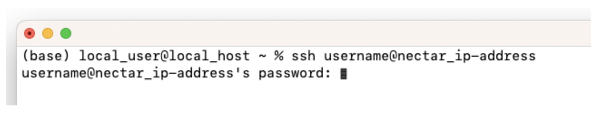
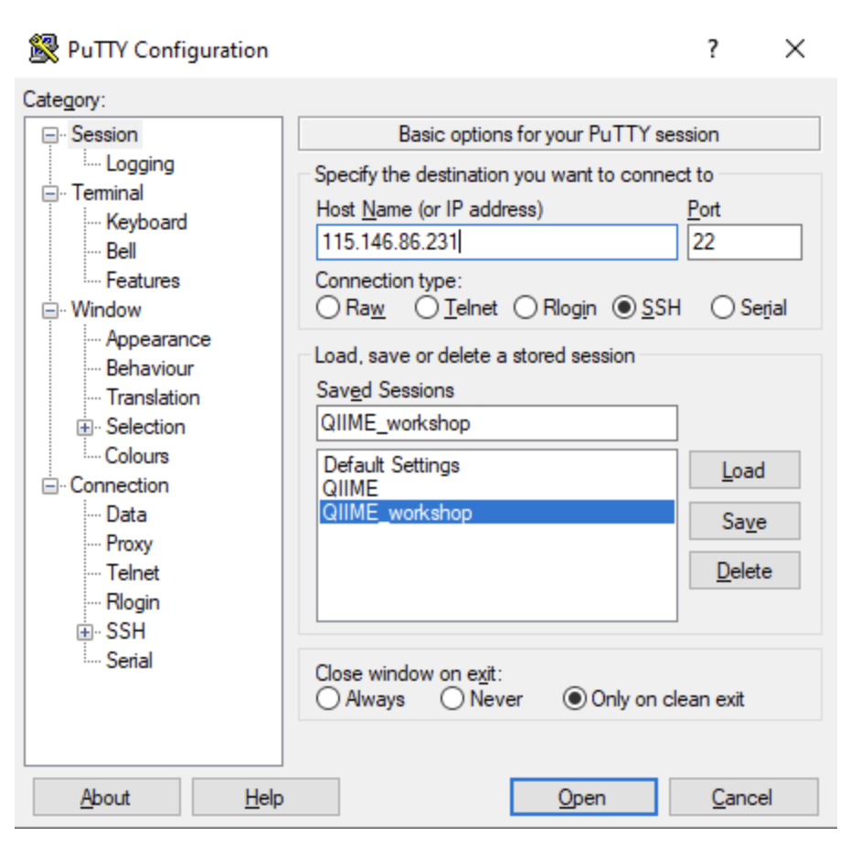

**Authors:** Melbourne Bioinformatics

::::::::::::::::::::::::::::::::::::: callout
#### Overview
The workshop you will be doing will run on a Nectar Instance. An
"Instance" is Nectar terminology for a virtual machine running on the
Nectar Cloud OpenStack infrastructure. An "Instance" runs on a "compute
node"; i.e. a physical computer populated with processor chips, memory
chips and so on.
::::::::::::::::::::::::::::::::::::::::::::::

## Objectives
- Understand what a Nectar Instance is and how it relates to the Nectar Cloud infrastructure.
- Identify the software required to access Nectar Instances on Mac and Windows systems.
- Successfully log in to a Nectar Instance using SSH on both Mac and Windows.
- Transfer files between a local machine and a Nectar Instance using SCP or file transfer software.
- Test your connection by transferring a test file (`test_transfer.txt`) from the instance to your local computer.
- Understand the purpose of `byobu-screen` and use it to maintain long-running sessions:
  - Start a named `byobu-screen` session.
  - Reconnect to a screen session after disconnection.
  - Detach and terminate a screen session safely.
- Know how to apply for your own Nectar allocation to run independent tutorials in the future.

## Logging on to a Nectar Instance

```{r setup, include=FALSE}
# Smaller images for pdf
# knitr::opts_chunk$set(out.width="50%")
options(width=80)
```

You will be given an individual username, IP address and password to log
on to using the SSH client tool on your computer (Terminal on Mac or
PuTTY on Windows).

-   **Host**: The IP address of the Nectar Instance
-   **Username**: `alpha` \| `beta` \| `gamma` \| `delta` \| `epsilon`
    \| `zeta`
-   **Port**: 22
-   **Password**: Provided to you separately

::::::::::::::::::::::::::::::::::::: callout

#### Attention

- Follow the instructions for your operating system carefully. 
- Repeated failed log in attempts might result in being locked out of the account. 

::::::::::::::::::::::::::::::::::::::::::::::


### Mac Users

In *Terminal*, type:
`ssh username@nectar_ip-address`

You will be prompted to enter your password. After you have entered your
password, hit `return`.

::: spoiler
### Mac Terminal Example

:::

::: spoiler
### I can't see my password as I'm typing it

You won't receive feedback when entering your password. Rest assured it
is being entered as you type it (or paste it in). Hit `return` after you have typed the whole password.
:::

### Windows Users: 
In `PuTTY`, enter the IP address as the host name and 22 for the port.

After you click “Open” you’ll be prompted to type the username you have been assigned (i.e. alpha | beta | gamma | delta | epsilon | zeta). Press <kbd>enter</kbd>. You will then be prompted for the password that has been given to you. Press <kbd>enter</kbd>.


::: spoiler
### Putty Example 

:::

::: spoiler 
### I can't see my password as I'm typing it 
You won’t receive feedback when entering your password. Rest assured it is being entered as you type it (or paste it in). Hit <kbd>enter</kbd> after you have typed the whole password.
:::

::: spoiler 
### How can I use copy and paste to enter my password? 
`PuTTY` has a different shortcut for paste compared to what you may be used to. Instead of <kbd>ctrl-v</kbd>, try right-clicking in the password field to paste the contents of your clipboard.
:::
