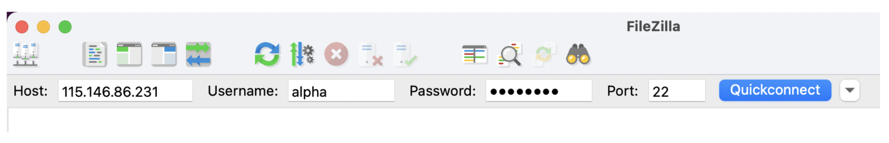

- `Host`: The IP address of the Nectar instance
- `Username`: alpha | beta | gamma | delta | epsilon | zeta
- `Port`: 22
- `Password`: Password that has been given to you.

### Mac Users
`scp` can be used to transfer files. Alternatively, novice Unix users may want to use [FileZilla](https://filezilla-project.org/). 

::: spoiler 
### Filezilla Example 

::: 

### Windows Users
Using file transfer software such as [FileZilla](https://filezilla-project.org/) or [WinSCP](https://winscp.net/eng/index.php)

::: spoiler 
### Filezilla Example 

::: 
